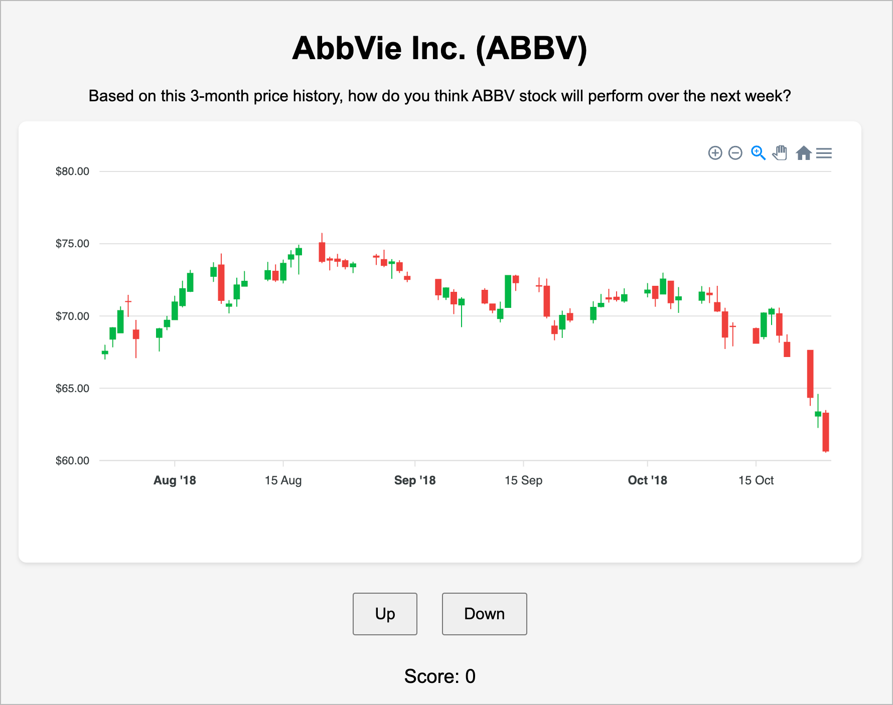

# Stocks :: Guru or Furu ?

This is an educational game that challenges players to predict short-term market movements.
Players are shown real historical stock charts from major companies, but with a twist - the last week of data is hidden.

They must analyze the trend and make a prediction: will the stock go up or down in the following week?

After making their prediction, players see what actually happened and earn points based on their accuracy.
No accounts needed - just jump in and start predicting!



## How to run it

### Clone Repo

```shell
git clone https://github.com/namuan/stocks-guru-or-furu.git
cd stocks-guru-or-furu
```

### Setup Virtual Environment

```shell
uv venv
```

### Install Dependencies

```shell
uv pip install -r requirements.txt
```

### Run Server

```shell
uv run backend/app.py
```

Visit `http://127.0.0.1:5001` in your browser.

## TODO

- [ ] Move business logic to server
